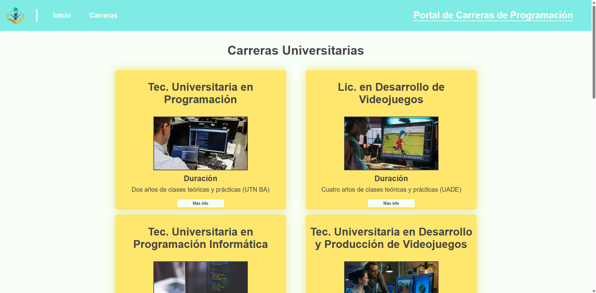
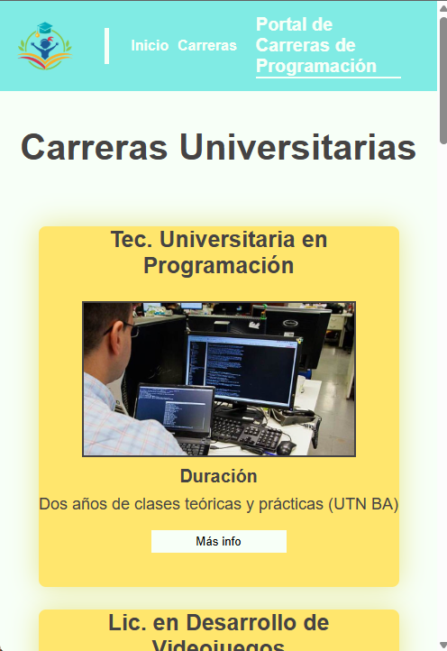

# Portal de Carreras de Programación
## Descripción
Sitio web informativo sobre carreras terciarias y universitarias en programación.
## Tecnologías
- HTML5 semántico
- CSS3 (Flexbox/Grid)
- Responsive Design
## Instalación
1. Clonar repositorio
2. Abrir `index.html` en navegador
## Capturas

## Autor
Tomás Aisama - Programación – 6°
